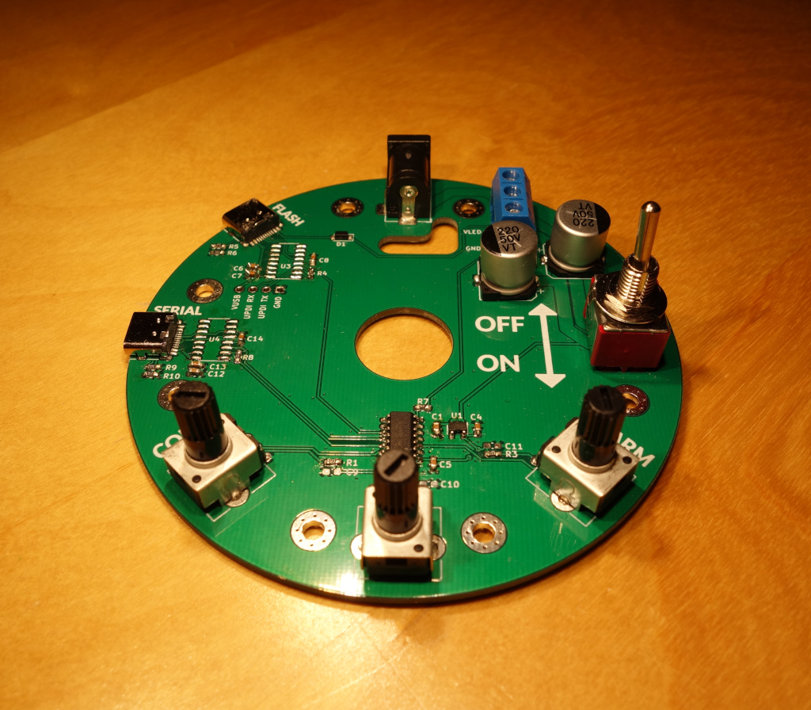

# desk lamp

An attempt to try to build something, mostly from materials I already had on hand.

White LED lamp made with aluminium PCBs

|  |  |
|-|-|
|  |  |

# Serial commands (115200 baud)

```
$ screen /dev/ttyUSB1 115200

lampsh> help
commands:

blink
debug
factory reset
fade custom [0.00-60.00] {0..3}
fade default [0.00-60.00]
fade led [0.00-60.00] {0..8} [dial{0,1,2}][:][0.00-100.00]
fade leds [0.00-60.00] [dial{0,1,2}][:][0.00-100.00] ... x 9
fade off [0.00-60.00]
fade on [0.00-60.00]
help
load blink
load calibrations
load custom {0..3}
load default
off
on
print
reset
restore blink
restore calibrations
restore custom {0..3}
restore default
save blink
save calibrations
save custom {0..3}
save default
set gamma {1.0-5.5}
set led {0..8} [dial{0,1,2}][:][0.00-100.00]
set leds [dial{0,1,2}][:][0.00-100.00] ... x 9
set max brightness {0.00-100.00}

```

## examples


```
lampsh> set max brightness 50.00               # set maximum brightness to 50%
lampsh> save                                   # make it permanent by saving it to eeprom
```

```
lampsh> set led 2 dial2:50.00                  # use dial2 to dim led 2 in the range 0%-50%

lampsh> set leds dial0 0 0 0 dial1 0 0 0 dial2 # drive one led/dial, each a different temp & pcb

lampsh> set leds dial0 dial1 dial2 dial0 dial1 dial2 dial0 dial1 dial2 # default setting
```

# Firmware

```
apt install avr-gcc gmake pip3
pip3 install pymcuprog
cd firmware/attiny1624
make
make flash

```

# LED brightness calculation

```

    per LED                                      interpolate       apply     scale
     config                                      transition        gamma   brightness
 --------------                                 -------------     -------  ----------
                                                                              max 
 current config                                t_cur / interval    gamma   brightness
                                                     |               |         |
 .-------------.                                     V               V         |
 | per LED     |               .---.         .---------------.  .--------.     |
 | brightness  |---------------- * --------->|          .__  |  |        |     V
 |_____________|               '-^-'         |        ."     |  |       '|   .---.
                                 |           |       /       |->|      / |-->| * |
 .-------------.           .------------. .->|      /        |  |     /  |   '---'
 | per LED     |-dial 0-2->| dial value | |  |  __-'         |  | __-'   |     |
 | dial select |           |------------| |  '_______________'  '________'     |
 |_____________|-no dial-->| max        | |  |               |                 V
                           |____________| |  | sigmoid       |          .------------.
 previous config                          |  | interpolation |          |    LED     |
                                          |  |_______________|          | brightness |
 .-------------.                          |                             '------------'
 | per LED     |               .---.      |
 | brightness  |---------------- * -------'
 |_____________|               '-^-'
                                 |
 .-------------.           .------------.
 | per LED     |-dial 0-2->| dial value |
 | dial select |           |------------|
 |_____________|-no dial-->| max        |
                           |____________|
                           
```

# LED PCBs are leftovers from:

https://github.com/brainsmoke/aluball

## PADAUK software:

https://github.com/brainsmoke/softpwmpdk

`./write.sh <address>` for each in 0..2

